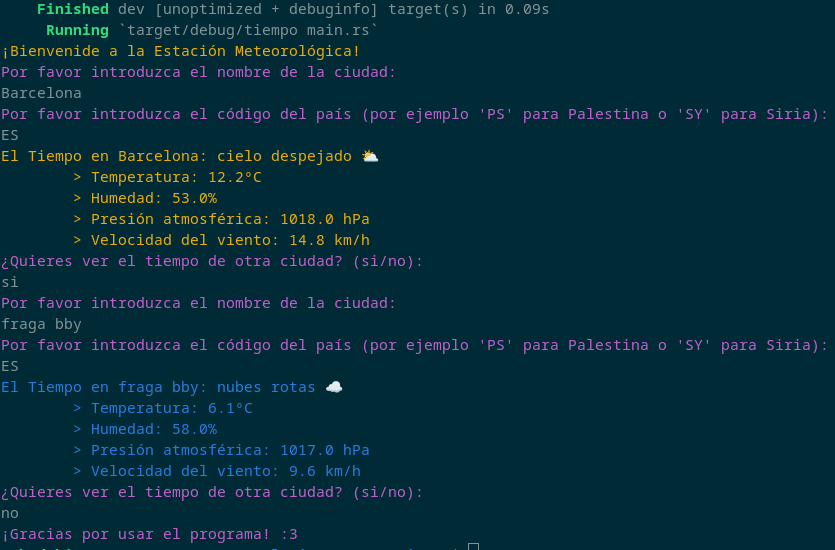

# El tiempo rust
App CLI para saber el tiempo escrita en Rust y usando API de [OpenWeatherMap](https://openweathermap.org/)

## Manual de uso
- Clonas el repositorio
 ``` 
git clone https://github.com/diego2444/el_tiempo_rust.git
```
- Entras en la carpeta del proyecto
```
cd el_tiempo_rust
```
- Compilas
```
cargo run
```
- Una vez compilado, te pedirá introducir el nombre de la ciudad y el código del país.
